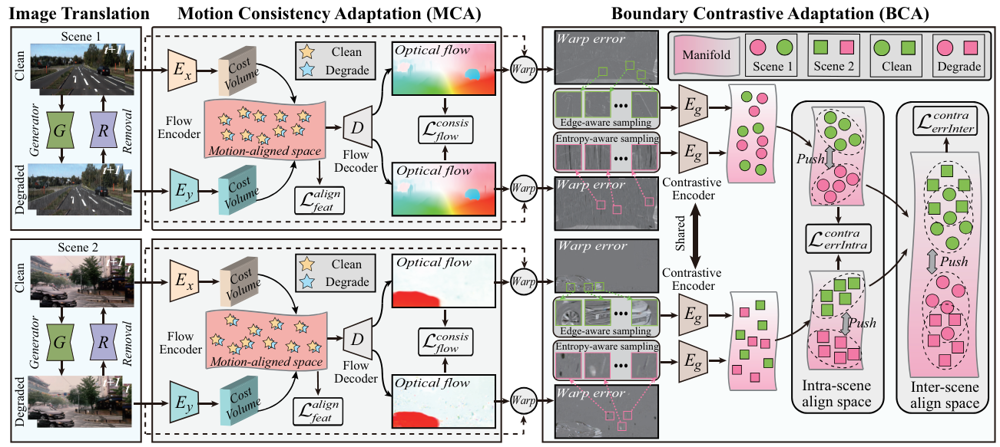

# Unsupervised Hierarchical Domain Adaptation for Rainy Scene Optical Flow

## AAAI 2023

### [Paper](https://ojs.aaai.org/index.php/AAAI/article/view/25490)

[Hanyu Zhou](https://hyzhouboy.github.io/) $^{1}$, [Yi Chang](https://owuchangyuo.github.io/) $^{1✉}$, [Gang Chen](https://scholar.google.com/citations?user=7GwIDigAAAAJ&hl=en) $^{2}$, [Luxin Yan](https://scholar.google.com/citations?user=5CS6T8AAAAAJ&hl=en) $^{1}$

$^1$ Huazhong University of Science and Technology

$^2$ Sun Yat-sen University

$^✉$ Corresponding Author.




## News

2026.1.3: All details are updated.

2023.02.06: Training and testing code is released.

2022.11.27: Our paper is accepted by AAAI 2023.

## Environmental Setups

```
git clone https://github.com/hyzhouboy/HMBA-FlowNet.git
cd HMBA-FlowNet
conda create -n HMBA-Flow python=3.7
conda activate HMBA-Flow

conda install cudatoolkit=10.0 cudnn=7.6 -y
pip install tensorflow-gpu==1.15.2
pip install pillow==7.1.2 scipy==0.19.1 opencv-python==4.2.0.34 matplotlib==3.2.1
```

## Preparing Dataset

We prepare the KITTI as the clean dataset, and rainy images as the degraded dataset. Note that the rainy images can collected from Internet. Keep the size of clean images and rainy images consistent.

## Training

The whole training pipeline refers to cycleflow_model_v7.py. We divide the whole training pipeline into five stages.

Stage 1: Training the optical flow model of clean domain in an unsupervised manner using KITTI dataset. We set the parameters of config.ini as follows, and then run "python main.py".

```
[run]
initial_learning_rate = 2e-4
batch_size = 8
save_dir = KITTI
model_name = kitti_2015_raw
mode = train
training_mode = no_distillation
training_stage = first_stage
is_restore_model = False

[dataset]
crop_h = 242
crop_w = 680
x_data_list_file = ./dataset/KITTI/x_train_with_id.txt
img_dir = ./KITTI/images
```

Stage 2-A: Generate pseudo flow labels for knowledge distillation. We set the parameters of config.ini as follows, and then run "python main.py".

```
[run]
initial_learning_rate = 2e-4
batch_size = 1
save_dir = KITTI
model_name = kitti_2015_raw
mode = generate_fake_flow_occlusion
training_mode = no_distillation
training_stage = second_stage
is_restore_model = False

[dataset]
crop_h = 242
crop_w = 680
x_data_list_file = ./dataset/KITTI/x_train_with_id.txt
img_dir = ./KITTI/images

[generate_fake_flow_occlusion]
restore_model = ./KITTI/models/data_distillation
save_dir = ./KITTI/sample/kitti_2015_raw
```

Stage 2-B: Training the optical flow model of clean domain in an self-supervised manner using pseudo flow labels. We set the parameters of config.ini as follows, and then run "python main.py".

```
[run]
initial_learning_rate = 2e-4
batch_size = 8
save_dir = KITTI
model_name = kitti_2015_raw
mode = train
training_mode = distillation
training_stage = second_stage
is_restore_model = True
flow_restore_model = ./KITTI/models/data_distillation

[dataset]
crop_h = 242
crop_w = 680
x_data_list_file = ./dataset/KITTI/x_train_with_id.txt
img_dir = ./KITTI/images

[distillation]
target_h = 224
target_w = 640

# Generated flow and occlusion map directory.
fake_flow_occ_dir = ./KITTI/sample/kitti_2015_raw
```

Stage 3: Training CycleGan-based optical flow models of clean domain and degraded domain via consistency loss using KITTI dataset and real rainy images. We set the parameters of config.ini as follows, and then run "python main.py".

```
[run]
initial_learning_rate = 1e-4
batch_size = 4
save_dir = KITTI
model_name = kitti_2015_raw
mode = train
training_mode = distillation
training_stage = three_stage
is_restore_model = True
flow_restore_model = ./KITTI/models/data_distillation
cyclegan_restore_model = ./KITTI/models/data_cyclegan

[dataset]
crop_h = 256
crop_w = 256
x_data_list_file = ./dataset/KITTI/x_train_with_id.txt
y_data_list_file = ./dataset/YourData/y_train_with_id.txt  # update your own datalist
img_dir = ./Your/Dataset
```

Stage 4: Train the optical flow models of clean domain and degraded domain via warp error contrastive learning using KITTI dataset and real rainy images. We set the parameters of config.ini as follows, and then run "python main.py".

```
[run]
initial_learning_rate = 1e-5
batch_size = 3
save_dir = KITTI
model_name = kitti_2015_raw
mode = train
training_mode = distillation
training_stage = forth_stage
is_restore_model = True
total_restore_model = ./KITTI/models/total_model

[dataset]
crop_h = 256
crop_w = 256
x_data_list_file = ./dataset/KITTI/x_train_with_id.txt
y_data_list_file = ./dataset/YourData/y_train_with_id.txt  # update your own datalist
img_dir = ./Your/Dataset
```

Stage 5: Full-parameter update the optical flow model of degraded domain but freezing the weights of the clean flow model. We set the parameters of config.ini as follows, and then run "python main.py".

```
[run]
initial_learning_rate = 1e-5
batch_size = 3
save_dir = KITTI
model_name = kitti_2015_raw
mode = train
training_mode = fine_tune
training_stage = fifth_stage
is_restore_model = True
final_restore_model = ./KITTI/models/final_total_model

[dataset]
crop_h = 242
crop_w = 680
x_data_list_file = ./dataset/KITTI/x_train_with_id.txt
y_data_list_file = ./dataset/YourData/y_train_with_id.txt  # update your own datalist
img_dir = ./Your/Dataset
```

## Testing

After training the final rainy flow model, we fix the config.ini and run command "python main.py":

```
[run]
mode = test

[dataset]
x_data_list_file = ./images/test_sample_list.txt
img_dir = ./images

[test]
# Restoration model name.
restore_model = ./KITTI/models_heavy/final_total_model
save_dir = ./images

```

## Citation

If you find this repository/work helpful in your research, welcome to cite this paper and give a ⭐.

```
@inproceedings{zhou2023unsupervised,
  title={Unsupervised hierarchical domain adaptation for adverse weather optical flow},
  author={Zhou, Hanyu and Chang, Yi and Chen, Gang and Yan, Luxin},
  booktitle={Proceedings of the AAAI conference on artificial intelligence},
  volume={37},
  number={3},
  pages={3778--3786},
  year={2023}
}
```
